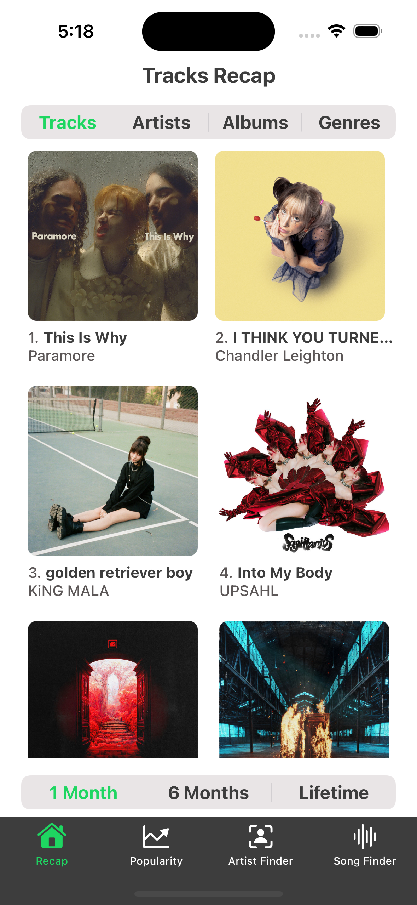

# Recap for Spotify

## Description
Recap for Spotify is a mobile app that displays users' Spotify data, such as their top tracks, artists, albums & genres over different periods. The app also enables users to generate playlists based on their favorite artists and genres.
## Features
- Login to Spotify Account with OAuth 2.0
- Get a summary of top tracks, artists, albums & genres over different periods
- Generate personalised playlists based on favorite artists or genres
## Screenshots
| Dark Mode | Light Mode |
| --- | --- |
|  |  |
|  |  |
|  |  |
|  |  |
|  |  |
|  |  |
|  |  |
|  |  |
|  |  |
|  |  |

## Requirements
- iOS version 16.0 or later
- Xcode version 14.2 or later

## Installation
1. Clone the repository
2. Open the project in Xcode
3. Build and run the app on a simulator or device
4. Sign in with your Spotify account & enjoy!